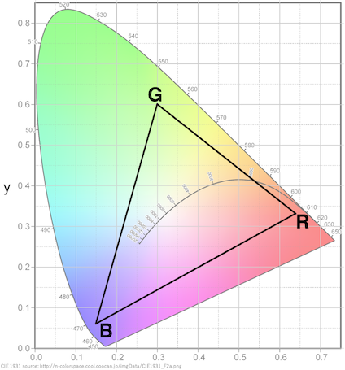

# WaveLength

It is a part of [kch-rgbw-lib](https://github.com/kchinzei/kch-rgbw-lib).
See [README.md](https://github.com/kchinzei/kch-rgbw-lib/blob/master/README.md)
for general information.

### Code snippet

In TypeScript/ES2015:

```TypeScript
import { CSpace, CSpaceTypes } from 'kch-rgbw-lib';
import { CIEnm2x, CIEnm2y, CIExy2nm } from 'kch-rgbw-lib';
import { checkCIExy, CIEfitxy2InList } from 'kch-rgbw-lib';
```

## API

### Functions

##### CIEnm2x(nm: number): number

##### CIEnm2y(nm: number): number

Return CIE-x or CIE-y value corresponding to the given wavelength in nm.

##### function CIExy2nm(xy: CSpace): number

Return wavelength that corresponds to CIE (x, y), in nanometer [nm].
When (x, y) is not on the CIE 1931 curve, it returns the projected point to the
curve. Note that the returned wavelength is meaningful only when (x, y)
is on or the curve. It internally calls CIEfitxy2List().

##### checkCIExyInList(xy: CSpace, xyList?: CSpace[]): boolean

Examine if a color `xy` is within the polygon given by `xyList`.
If `xyList` is omitted, the CIE 1931 gamut is used.
`checkCIExyInList()` can be used to check if a color is in the gamut represented by a combination of R-G-B LEDs (as figure below).


`xy` and `xyList` should be in 'xy' or 'xyY' of `CSpaceTypes`.
Other types will throw an exception.
`checkCIExyInList()`` uses an algorithm in https://www.nttpc.co.jp/technology/number_algorithm.html.

`xyList` is an array of CSpace, each element represents a vertex of the polygon.

IMPORTANT: when it's an n-vertex polygon, `xyList` requires n+1 elements,
where `xyList[n] = xyList[0]`, for the simpleness of the algorithm.

Rotation order of the points can be both CW and CCW.
The polygon can be concave, but the edges should not cross each other.

Note: For the purpose of checking the coverage of color sources, concave polygon is physically not meaningful.
You should use the outmost polygon made by the color sources.

###### function CIEfitxy2List(xy: CSpace, xyList?: CSpace[]): CSpace

Return the nearest point on the polygon given by `xyList`.
If `xyList` is omitted, the CIE 1931 gamut is used.
`CIEfitxy2List()` calculates the corresponding wave length on the CIE 1931 curve when `xyList` is omitted.
You can obtain the wave length by

````TypeScript
let c: CSpace = new CSpace('xy', [0.4, 0.6]);
c = CIEfitxy2List(c);
let waveLength = c.q; // in K
````

`xyList` is in the same format as `checkCIExyInList()`.
You must append the first point at the end of array.

")

- Whenever possible, it returns the @rpjected point on the curve (points 1-4).
- It can determine the projection even the input is outside the curve.
- Eventually it appears not exactly on the curve due to the interpolation (4).
- However it does not interpolate between 405nm and 700 nm.
  In such case, it returns either 405 nm or 700 nm point (5, 6).
- Note that it can return physically nonsense wave WaveLength
if the input is far from the CIE 1931 curve (7).

# License

The MIT License (MIT)
Copyright (c) K. Chinzei (kchinzei@gmail.com)
Permission is hereby granted, free of charge, to any person obtaining a copy
of this software and associated documentation files (the "Software"), to deal
in the Software without restriction, including without limitation the rights
to use, copy, modify, merge, publish, distribute, sublicense, and/or sell
copies of the Software, and to permit persons to whom the Software is
furnished to do so, subject to the following conditions:
The above copyright notice and this permission notice shall be included in
all copies or substantial portions of the Software.
THE SOFTWARE IS PROVIDED "AS IS", WITHOUT WARRANTY OF ANY KIND, EXPRESS OR
IMPLIED, INCLUDING BUT NOT LIMITED TO THE WARRANTIES OF MERCHANTABILITY,
FITNESS FOR A PARTICULAR PURPOSE AND NONINFRINGEMENT. IN NO EVENT SHALL THE
AUTHORS OR COPYRIGHT HOLDERS BE LIABLE FOR ANY CLAIM, DAMAGES OR OTHER
LIABILITY, WHETHER IN AN ACTION OF CONTRACT, TORT OR OTHERWISE, ARISING FROM,
OUT OF OR IN CONNECTION WITH THE SOFTWARE OR THE USE OR OTHER DEALINGS IN
THE SOFTWARE.
